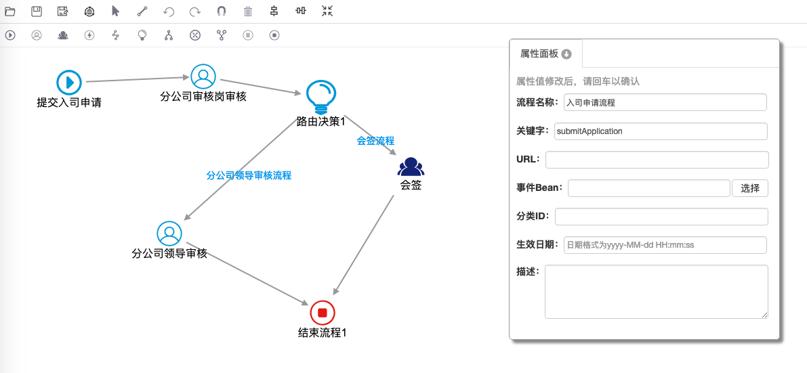

# Uflo-Demo
A demo project for Uflo framwork,which is a lightweight workflow framework make you develop easily
## 完整的实现了一个示例，从人员入司提交申请到分公司审核、再上级审核。以及根据不同的职级岗位实现不同的流程，包括会签流程

## 具体开发参见代码当中的 README.md 需要点uflo-test文件夹进去看
## 图例

